# Kompleksowe Podsumowanie Medyczne Pacjenta

## Dane Pacjenta

| Pole               | Informacje                                                |
| ------------------ | --------------------------------------------------------- |
| **Imię**           | Charlie                                                   |
| **Gatunek**        | Kot (Felis catus)                                         |
| **Rasa**           | Egipski Mau / Mieszaniec                                  |
| **Płeć**           | Samiec kastrowany                                         |
| **Data urodzenia** | Około styczeń 2015                                        |
| **Aktualny wiek**  | 10 lat 2 miesiące (stan na styczeń 2026)                  |
| **Masa ciała**     | **3,95 kg** (spadek z 4,5-4,7 kg - stan na 29.01.2026) ⚠️ |
| **Umaszczenie**    | Smoky grey / bura                                         |

---

## Lista Aktywnych Problemów

### 1. Rak In Situ Typu Bowenoidnego (Priorytet: WYSOKI)

**Pełna chronologia podejrzeń nowotworowych w historii pacjenta:**

*Wcześniejsze podejrzenia OUN (2022-2023) - ostatecznie niewykluczone:*
- **23.12.2022**: Podejrzenie zmiany nowotworowej OUN - "Diagnoza: Podejrzewam problem w ośrodkowym układzie nerwowym - zmiana nowotworowa" - [Konsultacja ZdrowyPupil](https://drive.google.com/file/d/1GT7MktyfZBzHi0VgP-3n3PZJegEt_L-4/view?usp=drivesdk)
- **28.12.2022**: MRI Th1-S3 - podejrzenie zmiany zewnątrz-/wewnątrzoponowej L5-L6, diagnoza różnicowa: pierwotna zmiana nowotworowa (chłoniak, oponiak, mięsak histiocytarny) vs. zapalna - [Opis wizyty MRI](https://drive.google.com/file/d/1o5KGed8hfkAX-6bholvU29O2f8Biqm4H/view?usp=drivesdk)
- **28.12.2022**: Konsultacja NeuroTeam - przyczyna rozrostowa (pierwotna lub przerzutowa) w diagnostyce różnicowej - [Konsultacja NeuroTeam](https://drive.google.com/file/d/12LJF92G4bKIzcJJYlWu-rTwxyl1H8qgn/view?usp=drivesdk)
- **02.01.2023**: RTG klatki piersiowej - brak zmian przerzutowych - [Wyniki RTG](https://drive.google.com/file/d/1Y2JcIS_YZEhp62CIO12Qw-A2iNWOaxha/view?usp=drivesdk)
- **11.02.2023**: Test klonalności limfocytów (PARR) - niewystarczająca ilość DNA, chłoniak nie potwierdzony ale nie wykluczony - [Klonalność limfocytów](https://drive.google.com/file/d/1vI1yxqiduT-sj6KOAwxhji2sAOE_R9wf/view?usp=drivesdk)

*Diagnostyka zmian skórnych (2025-2026):*
- **04.07.2025**: Pierwsze odnotowanie zmian skórnych - strupki na karku i szyi, ciemna zmiana w typie brodawki pod brodą - [Podsumowanie GoldenVet](https://drive.google.com/file/d/1a9Jzw0eBVkj17FoAqpqbI30y3xQRq3DZ/view?usp=drivesdk)
- **25.07.2025**: Cytologia odciskowa ze zmiany na szyi po usunięciu zrogowaciałego tworu - niediagnostyczna - [Podsumowanie GoldenVet](https://drive.google.com/file/d/1a9Jzw0eBVkj17FoAqpqbI30y3xQRq3DZ/view?usp=drivesdk)
- **01.08.2025**: Cytologia - elementy krwi, łuski keratynowe, keratynocyty bezjądrzaste - niediagnostyczna - [Badanie cytologiczne](https://drive.google.com/file/d/19GmfMXjmXQejqtEIgM8NsP3X7zSAqPMv/view?usp=drivesdk)
- **29.08.2025**: Nowa zmiana na karku, podobna do tej na szyi - [Podsumowanie GoldenVet](https://drive.google.com/file/d/1a9Jzw0eBVkj17FoAqpqbI30y3xQRq3DZ/view?usp=drivesdk)
- **12.09.2025**: Konsultacja onkologiczna (dr Bugiel-Stabla) - liczne zmiany na karku i szyi (strupy, krosty), FNA z wrzodu na szyi, cytologia: złuszczone komórki naskórka, erytrocyty, nieliczne limfocyty - [Podsumowanie GoldenVet](https://drive.google.com/file/d/1a9Jzw0eBVkj17FoAqpqbI30y3xQRq3DZ/view?usp=drivesdk)
- **29.09.2025**: Cytologia kontrolna - pojedyncze bakterie, komórki zapalne, **pojedyncze komórki atypowe** - [Podsumowanie GoldenVet](https://drive.google.com/file/d/1a9Jzw0eBVkj17FoAqpqbI30y3xQRq3DZ/view?usp=drivesdk)
- **16.12.2025**: Biopsja trepanowa ze zmienionej skóry w znieczuleniu ogólnym - [Raport endoskopia](https://drive.google.com/file/d/1TTBRWY-vsmuw71NFM_yC1MSvzkDEkKPj/view?usp=drivesdk)
- **27.01.2026**: Wynik histopatologii - **RAK IN SITU TYPU BOWENOIDNEGO** - [Histopatologia](https://drive.google.com/file/d/1z8WjvMwm7kS_0TaGxO2DLfAN_fkO00i9/view?usp=drivesdk), [Podsumowanie GoldenVet](https://drive.google.com/file/d/1a9Jzw0eBVkj17FoAqpqbI30y3xQRq3DZ/view?usp=drivesdk)
- **29.01.2026**: Konsultacja onkologiczna NeoVet (lek. wet. Imane Sghir) - [Konsultacja onkologiczna](https://drive.google.com/file/d/1-SPo1d2gm6434sb32Ksi9ocRIvlI1hek/view?usp=drivesdk):
  - **Waga: 3,95 kg** - znaczny spadek (~12-15% masy ciała) ⚠️
  - Miejsce po usunięciu zmiany na grzbiecie - brak wyczuwalnych nieprawidłowości
  - **Nowe zmiany**: zmiana brodawkowata w okolicy potylicznej, dwie zmiany pod żuchwą na szyi (jedna ostatnio urosła)
  - Stan zapalny przyzębia
  - **Wskazanie do RTG klatki piersiowej i USG jamy brzusznej** ze względu na utratę masy ciała
  - Kontakt mailowy ws. badania CISH na FcaPV-2

*Podsumowanie*
- **Status**: Zdiagnozowany styczeń 2026, zmiany obserwowane od co najmniej lipca 2025, nowe/rosnące zmiany stwierdzone 29.01.2026
- **Lokalizacja**: Skóra grzbietu (szyi i karku), okolica potyliczna, pod żuchwą
- **Status marginesów**: Guz przy marginesie bocznym - niepełne wycięcie
- **PILNE - Następne kroki**:
  - ⚠️ RTG klatki piersiowej i USG jamy brzusznej (wskazane ze względu na utratę masy ciała)
  - Badanie CISH na FcaPV-2 (decyzja po kontakcie mailowym)
  - Monitorować pod kątem progresji zmian (jedna zmiana pod żuchwą urosła)
  - Rozważyć dalsze wycięcie chirurgiczne

### 2. Przewlekłe Zapalenie Zatok/Oskrzeli
*Źródła: [Endoskopia 29.11.2024](https://drive.google.com/file/d/1VEo_LOTZe93oXq_K-6P8_vy39q-wmFtX/view?usp=drivesdk), [Mycoplasma 19.12.2025](https://drive.google.com/file/d/1PSzra36OYdkiMwxAUiaxkXxThXijjPIT/view?usp=drivesdk)*

- **Status**: Trwające, ale poprawione
- **Kluczowe znaleziska**: Mycoplasma wyleczona (grudzień 2025), ale obecne przewlekłe zmiany strukturalne
- **Postępowanie**: Leczenie objawowe, mukolityki, wsparcie odporności
- **Uwaga**: Możliwe przewlekłe zmiany po przebytym kocim katarze wirusowym

### 3. Zaburzenie Neurologiczne (Stabilne)
*Źródła: [MRI 28.12.2022](https://drive.google.com/file/d/1e7d9912P4zOgCHoSFpl8WxGRk0HLaiGt/view?usp=drivesdk), [Konsultacje NeuroTeam 2022-2023](https://drive.google.com/file/d/10-g0nG-ljxH4vgqwovn0jGZFYXFJ2TKV/view?usp=drivesdk)*

- **Status**: Klinicznie stabilne od 2023
- **Etiologia**: Nigdy nie ustalona definitywnie; podejrzewane autoimmunologiczne/zapalne
- **Aktualny stan**: Łagodna resztkowa ataksja, utrzymuje dobrą jakość życia
- **Aktywne leczenie nie wymagane** chyba że nastąpi pogorszenie kliniczne

### 4. Podejrzewane IBD / Choroba Przewodu Pokarmowego
*Źródła: [Wyniki kału 26.04.2023](https://drive.google.com/file/d/1y3npPPkhQnow00_nrpXAza7DgrkLbhoi/view?usp=drivesdk), [USG 28.12.2022](https://drive.google.com/file/d/1v2ZMwvKAgelGmOraJCmUL5eNGy6Wdj25/view?usp=drivesdk)*

- **Dowody**: Niskie B12, krew utajona dodatnia, zmiany ściany jelita w USG
- **Status**: Obecnie bez aktywnych objawów
- **Monitorować**: Apetyt, epizody wymiotów, masę ciała

### 5. Przewlekła Leukopenia/Neutropenia
*Źródła: [Morfologia 27.11.2025](https://drive.google.com/file/d/1Q9mUHmzC6Jr02uxGzuSA0zmOdPwWJOo-/view?usp=drivesdk), [Seria morfologii 2022-2025](https://drive.google.com/file/d/1xJ-8iXeiYjYS-IJOZwV81v0B6-NI_GPr/view?usp=drivesdk)*

- **Status**: Utrzymujące się znalezisko
- **Prawdopodobne przyczyny**: Efekt choroby przewlekłej, możliwy wpływ historii lekowej
- **Znaczenie kliniczne**: Zwiększona podatność na infekcje
- **Postępowanie**: Monitorować pod kątem infekcji, unikać immunosupresji jeśli możliwe

---

## Aktualne Leki i Suplementy (stan na styczeń 2026)

| Lek          | Dawka      | Częstotliwość | Cel                       |
| ------------ | ---------- | ------------- | ------------------------- |
| Rhinobiom    | wg zaleceń | 1x dziennie   | Probiotyk do jamy nosowej |
| FloraBalance | 1 kapsułka | 1x dziennie   | Probiotyk jelitowy        |
| Flegamina    | 2.4ml      | 1x dziennie   | Rozrzedzenie śluzu        |

---

## Wrażliwość na Leki i Reakcje
*Źródła: [Zdrowy Pupil - podsumowanie 2022-2024](https://drive.google.com/file/d/1fr6toKDIdb-aQDgQW2bCDSr4FWRTaCLR/view?usp=drivesdk), [Podsumowanie GoldenVet 2024-2026](https://drive.google.com/file/d/1a9Jzw0eBVkj17FoAqpqbI30y3xQRq3DZ/view?usp=drivesdk)*

- Dobrze toleruje NLPZ (meloksykam, loxicom)
- Dobrze toleruje steroidy (prednizolon), ale monitorować działania niepożądane
- Antybiotyki stosowane bez reakcji niepożądanych: Marbofloksacyna, Amoksycylina z kwasem klawulanowym, Doxycyklina, Azytromycyna

**Zalecenia dietetyczne:**
- Wykluczenie drobiu z diety (kurczak, indyk, kaczka) - zalecone lipiec 2025

---

## Status Szczepień

| Szczepienie                  | Data       | Seria   | Ważne do   | Źródło                                                                              |
| ---------------------------- | ---------- | ------- | ---------- | ----------------------------------------------------------------------------------- |
| Nobivac Rabies (wścieklizna) | 04.07.2025 | A755A01 | 31.05.2028 | [Wizyta GoldenVet 04.07.2025](https://drive.google.com/file/d/1kYEohfjy1RrdBzq-FQhMcaTNPWrv4f8R/view?usp=drivesdk) |

**Uwaga**: Szczepienie wykonane ze względu na długi czas od ostatniego szczepienia i planowaną podróż za granicę (Belgia, Holandia)

---

## Kluczowe Wartości Referencyjne w Czasie

### Trendy Białych Krwinek
*Źródła: [Seria wyników krwi 2022-2025](https://drive.google.com/file/d/16-y-Z4IdvyTkcc84A5zjXJEVrSEol0LW/view?usp=drivesdk), [Morfologia 27.11.2025](https://drive.google.com/file/d/1Q9mUHmzC6Jr02uxGzuSA0zmOdPwWJOo-/view?usp=drivesdk)*

| Data       | WBC (G/l) | NEU (G/l) | LYM (G/l) | Uwagi                          | Źródło                                                                                |
| ---------- | --------- | --------- | --------- | ------------------------------ | ------------------------------------------------------------------------------------- |
| 31.10.2022 | 4,9       | 4,0       | 0,8       | Epizod zapalenia pęcherza      | [Zdrowy Pupil](https://drive.google.com/file/d/1fr6toKDIdb-aQDgQW2bCDSr4FWRTaCLR/view?usp=drivesdk)           |
| 21.11.2022 | 4,3       | 2,6       | 1,2       | Przed objawami neurologicznymi | [Archivet](https://drive.google.com/file/d/16-y-Z4IdvyTkcc84A5zjXJEVrSEol0LW/view?usp=drivesdk)            |
| 21.12.2022 | 2,89      | 1,64      | 0,94      | Początek objawów neuro         | [Archivet](https://drive.google.com/file/d/17dsHOQcOeLGIgVN3zy74won2hq2OpKle/view?usp=drivesdk)            |
| 09.01.2023 | 5,11      | 4,10      | 0,90      | Na steroidach                  | [Archivet](https://drive.google.com/file/d/1qV9-GGtKO5G778LNo6C5-MlSppmTfpkp/view?usp=drivesdk)            |
| 09.03.2023 | 2,28      | 1,38      | 0,61      | Po steroidach                  | [Zdrowy Pupil](https://drive.google.com/file/d/1xJ-8iXeiYjYS-IJOZwV81v0B6-NI_GPr/view?usp=drivesdk) |
| 24.03.2023 | 4,29      | 2,24      | 1,56      | Poprawa                        | [Zdrowy Pupil](https://drive.google.com/file/d/100BztocvdYfyKLB-mh3Ly3ZM8cjgbvHR/view?usp=drivesdk) |
| 26.11.2024 | 7,17      | 4,49      | 1,85      | Najlepszy ostatnio             | [NeoVet](https://drive.google.com/file/d/168Za_7dMCq3rbJgUJNkdSSEDUGZ_z6tG/view?usp=drivesdk)               |
| 27.11.2025 | 3,55      | 1,79      | 1,38      | Przed biopsją                  | [Morfologia](https://drive.google.com/file/d/1Q9mUHmzC6Jr02uxGzuSA0zmOdPwWJOo-/view?usp=drivesdk)                            |

**Zakresy Normy:**
- **WBC (Białe krwinki)**: 6-11 G/l (reference range)
- **NEU (Neutrofile)**: 3-11 G/l
- **LYM (Limfocyty)**: 1-4 G/l

**Analiza Trendu:**
Charlie wykazuje przewlekłą **leukopeniię/neutropeniię** - wartości WBC i NEU poniżej normy przez większość okresu obserwacji. Najlepsze wyniki (7,17 WBC, 4,49 NEU) w listopadzie 2024, znaczny spadek w listopadzie 2025.

```mermaid
graph TD
    A["<b>TRENDY BIAŁYCH KRWINEK (2022-2025)</b><br/>Norma: WBC 6-11 | NEU 3-11 | LYM 1-4 G/l"]

    subgraph chart["📊 WYKRES TRENDÓW"]
        B["<b>Oś X:</b> Czas (październik 2022 - listopad 2025)<br/><b>Oś Y:</b> Wartość (G/l)<br/><br/>
        <b style='color:red'>━━━ WBC</b> (Białe krwinki)<br/>
        <b style='color:orange'>━━━ NEU</b> (Neutrofile)<br/>
        <b style='color:blue'>━━━ LYM</b> (Limfocyty)<br/>
        <b style='color:green'>░░░ NORMA MIN/MAX</b>"]
    end

    subgraph oct22["Październik 2022"]
        C["WBC: 4,9 ⚠️<br/>NEU: 4,0 ✓<br/>LYM: 0,8 ⚠️"]
    end

    subgraph nov22["Listopad 2022"]
        D["WBC: 4,3 ⚠️<br/>NEU: 2,6 ⚠️<br/>LYM: 1,2 ✓"]
    end

    subgraph dec22["Grudzień 2022<br/>(Objawy neuro)"]
        E["WBC: 2,89 🔴<br/>NEU: 1,64 🔴<br/>LYM: 0,94 ⚠️"]
    end

    subgraph jan23["Styczeń 2023<br/>(Na steroidach)"]
        F["WBC: 5,11 ⚠️<br/>NEU: 4,10 ✓<br/>LYM: 0,90 ⚠️"]
    end

    subgraph mar23["Marzec 2023<br/>(Spadek po steroidach)"]
        G["WBC: 2,28 🔴<br/>NEU: 1,38 🔴<br/>LYM: 0,61 🔴"]
    end

    subgraph mar23b["Marzec 2023<br/>(Poprawa)"]
        H["WBC: 4,29 ⚠️<br/>NEU: 2,24 ⚠️<br/>LYM: 1,56 ✓"]
    end

    subgraph nov24["Listopad 2024<br/>(NAJLEPSZE)"]
        I["WBC: 7,17 ✓<br/>NEU: 4,49 ✓<br/>LYM: 1,85 ✓"]
    end

    subgraph nov25["Listopad 2025<br/>(Przed biopsją)"]
        J["WBC: 3,55 ⚠️<br/>NEU: 1,79 🔴<br/>LYM: 1,38 ✓"]
    end

    subgraph assessment["📋 OCENA"]
        K["<b>Główny problem:</b> Przewlekła neutropenia<br/>
        <b>Trend:</b> Ogólnie niska, z krótkim poprawieniem w 2024<br/>
        <b>Ryzyko:</b> Zwiększona podatność na infekcje<br/>
        <b>Znaczenie:</b> Monitorować regularnie"]
    end

    A --> chart
    chart --> oct22 --> nov22 --> dec22 --> jan23 --> mar23 --> mar23b --> nov24 --> nov25
    nov25 --> assessment

    style C fill:#ffe6e6
    style D fill:#ffe6e6
    style E fill:#ff9999
    style F fill:#ffe6e6
    style G fill:#ff9999
    style H fill:#ffe6e6
    style I fill:#e6ffe6
    style J fill:#ffe6e6
    style assessment fill:#fff4e6
```

### Trendy Funkcji Wątroby
*Źródła: [Seria wyników krwi 2022-2025](https://drive.google.com/file/d/17dsHOQcOeLGIgVN3zy74won2hq2OpKle/view?usp=drivesdk)*

| Data       | ALT (U/l) | AST (U/l) | Uwagi                | Źródło                                                                                |
| ---------- | --------- | --------- | -------------------- | ------------------------------------------------------------------------------------- |
| 21.12.2022 | 33,6      | 35,2      | Wartości wyjściowe   | [Archivet](https://drive.google.com/file/d/17dsHOQcOeLGIgVN3zy74won2hq2OpKle/view?usp=drivesdk)            |
| 09.01.2023 | 276,2     | 109,2     | Efekt steroidów      | [Archivet](https://drive.google.com/file/d/1qV9-GGtKO5G778LNo6C5-MlSppmTfpkp/view?usp=drivesdk)            |
| 09.03.2023 | 50        | 22,7      | Poprawa              | [Zdrowy Pupil](https://drive.google.com/file/d/1xJ-8iXeiYjYS-IJOZwV81v0B6-NI_GPr/view?usp=drivesdk) |
| 26.11.2024 | 96,5      | 58        | Łagodne podwyższenie | [NeoVet](https://drive.google.com/file/d/168Za_7dMCq3rbJgUJNkdSSEDUGZ_z6tG/view?usp=drivesdk)               |
| 27.11.2025 | 59,1      | 44,7      | Akceptowalne         | [Morfologia](https://drive.google.com/file/d/1Q9mUHmzC6Jr02uxGzuSA0zmOdPwWJOo-/view?usp=drivesdk)                            |

### Funkcja Nerek
*Źródła: [Seria wyników krwi 2022-2025](https://drive.google.com/file/d/17dsHOQcOeLGIgVN3zy74won2hq2OpKle/view?usp=drivesdk)*

| Data       | Kreatynina   | Mocznik     | Uwagi               | Źródło                                                                     |
| ---------- | ------------ | ----------- | ------------------- | -------------------------------------------------------------------------- |
| 21.12.2022 | 109,5 µmol/l | 4,12 mmol/l | Prawidłowa          | [Archivet](https://drive.google.com/file/d/17dsHOQcOeLGIgVN3zy74won2hq2OpKle/view?usp=drivesdk) |
| 26.11.2024 | 117,2 µmol/l | 11,4 mmol/l | Górna granica normy | [NeoVet](https://drive.google.com/file/d/168Za_7dMCq3rbJgUJNkdSSEDUGZ_z6tG/view?usp=drivesdk)    |
| 27.11.2025 | 109,6 µmol/l | 7,83 mmol/l | Prawidłowa          | [Morfologia](https://drive.google.com/file/d/1Q9mUHmzC6Jr02uxGzuSA0zmOdPwWJOo-/view?usp=drivesdk)                 |

---

## Podsumowanie Badań w Kierunku Chorób Zakaźnych

| Test                         | Data       | Wynik                   | Źródło                                                                              |
| ---------------------------- | ---------- | ----------------------- | ----------------------------------------------------------------------------------- |
| FeLV                         | 21.12.2022 | UJEMNY                  | [Archivet](https://drive.google.com/file/d/17dsHOQcOeLGIgVN3zy74won2hq2OpKle/view?usp=drivesdk)          |
| FIV                          | 21.12.2022 | UJEMNY                  | [Archivet](https://drive.google.com/file/d/17dsHOQcOeLGIgVN3zy74won2hq2OpKle/view?usp=drivesdk)          |
| FeLV                         | 18.01.2023 | UJEMNY                  | [Archivet](https://drive.google.com/file/d/1h7YQH_Up5lHka8xiYJlB76Ax6s5D4L6v/view?usp=drivesdk)        |
| FIV                          | 18.01.2023 | UJEMNY                  | [Archivet](https://drive.google.com/file/d/1h7YQH_Up5lHka8xiYJlB76Ax6s5D4L6v/view?usp=drivesdk)        |
| Toxoplasma gondii (IgG/IgM)  | 21.12.2022 | UJEMNY                  | [Archivet](https://drive.google.com/file/d/17dsHOQcOeLGIgVN3zy74won2hq2OpKle/view?usp=drivesdk)          |
| Toxoplasma gondii (PCR, PMR) | 25.01.2023 | UJEMNY                  | [PMR wyniki](https://drive.google.com/file/d/1h9Hw1SpcnuQrqwsRGwGcdVAoSXWRQ37S/view?usp=drivesdk)        |
| Koronawirus/FIP (PCR, PMR)   | 25.01.2023 | UJEMNY                  | [PMR wyniki](https://drive.google.com/file/d/1h9Hw1SpcnuQrqwsRGwGcdVAoSXWRQ37S/view?usp=drivesdk)        |
| **Posiew z nosa**            | 04.10.2024 | **Serratia marcescens** | [GoldenVet](https://drive.google.com/file/d/1u-Odh7PrzsaF0xtPj0hkNUl-oY8r2sAH/view?usp=drivesdk)                 |
| Chlamydia felis (PCR)        | 04.12.2024 | UJEMNY                  | [Mycoplasma](https://drive.google.com/file/d/1MX6WmAUtlnElkM1hrmBMFigY1WX2-roB/view?usp=drivesdk)    |
| Mycoplasma spp. (PCR)        | 04.12.2024 | **DODATNI**             | [Mycoplasma](https://drive.google.com/file/d/1MX6WmAUtlnElkM1hrmBMFigY1WX2-roB/view?usp=drivesdk)    |
| Actinomyces sp.              | 04.12.2024 | DODATNI (+)             | [Mycoplasma](https://drive.google.com/file/d/1MX6WmAUtlnElkM1hrmBMFigY1WX2-roB/view?usp=drivesdk)    |
| Mycoplasma spp. (PCR)        | 22.12.2025 | **UJEMNY**              | [GoldenVet](https://drive.google.com/file/d/1a9Jzw0eBVkj17FoAqpqbI30y3xQRq3DZ/view?usp=drivesdk)              |
| Giardia                      | 25.04.2023 | UJEMNY                  | [Wyniki kału](https://drive.google.com/file/d/1y3npPPkhQnow00_nrpXAza7DgrkLbhoi/view?usp=drivesdk) |

---

## Podsumowanie Badań Obrazowych

### MRI Kręgosłupa (28.12.2022)
*Źródło: [Opis MRI Neuroteam](https://drive.google.com/file/d/12LJF92G4bKIzcJJYlWu-rTwxyl1H8qgn/view?usp=drivesdk) [Opis MRI](https://drive.google.com/file/d/1e7d9912P4zOgCHoSFpl8WxGRk0HLaiGt/view?usp=drivesdk), [Opis wizyty MRI](https://drive.google.com/file/d/1o5KGed8hfkAX-6bholvU29O2f8Biqm4H/view?usp=drivesdk)*

- Odcinek piersiowo-lędźwiowy Th1-S3
- Nieprawidłowość w L3-L5: Poszerzony kanał centralny
- Podejrzewana zmiana zewnątrzoponowa/wewnątrzoponowa na poziomie korzenia nerwowego L5-L6 (strona prawa)
- Brak wzmocnienia kontrastowego

### USG Jamy Brzusznej (28.12.2022)
*Źródło: [Wyniki USG](https://drive.google.com/file/d/1v2ZMwvKAgelGmOraJCmUL5eNGy6Wdj25/view?usp=drivesdk)*

- Łagodna limfadenopatia (węzły krezkowe)
- Ściana jelita cienkiego pogrubiona ze zmianami śluzówki sugerującymi przewlekłe zapalenie

### RTG Klatki Piersiowej (02.01.2023)
*Źródła: [Opis RTG](https://drive.google.com/file/d/1eOY_FVHajMsSOc0kLP_8K4tvzIHqEw0N/view?usp=drivesdk), [Wyniki RTG](https://drive.google.com/file/d/1Y2JcIS_YZEhp62CIO12Qw-A2iNWOaxha/view?usp=drivesdk)*

- Pola płucne czyste
- Brak zmian przerzutowych
- Wielkość serca prawidłowa

### Echokardiografia (25.11.2024)
*Źródło: [Wyniki kardio](https://drive.google.com/file/d/15LP0Yy8Wbhjk4goRmE6J9AJBFUyOieDJ/view?usp=drivesdk)*

- Prawidłowa budowa i funkcja serca
- Umiarkowana niedomykalność trójdzielna (bez istotności hemodynamicznej)
- Wariant anatomiczny: Rzekome struny ścięgniste

### Kontrolna Rynoskopia (16.12.2025)
*Źródło: [Raport endoskopia 16.12.2025](https://drive.google.com/file/d/1TTBRWY-vsmuw71NFM_yC1MSvzkDEkKPj/view?usp=drivesdk)*

- **Lewe nozdrze**: Wejście zwężone, wzmocniony rysunek naczyń, bardzo liczna wydzielina śluzowa
- **Małżowina nosowa lewa**: Lekko przebudowana - drobne guzki na małżowinie (zmiany pozapalne?)
- Brak jednorodnej zmiany rozrostowej typu polipa
- **Prawe nozdrze**: Mniejsza ilość wydzieliny, brak obrzęku i przekrwienia
- **Wniosek**: Przewlekła przebudowa struktur pozapalna, bez cech nowotworowych

---

## Zalecenia Kliniczne dla Przyszłej Opieki

### Priorytety Natychmiastowe
*Na podstawie: [Histopatologia 18.12.2025](https://drive.google.com/file/d/1z8WjvMwm7kS_0TaGxO2DLfAN_fkO00i9/view?usp=drivesdk)*

1. **Konsultacja onkologiczna** w sprawie raka bowenoidnego - ocena potrzeby szerszego wycięcia, badanie FcaPV-2
2. **Monitorować pod kątem nowych zmian skórnych** - choroba może być wieloogniskowa
3. **Kontynuować wspomagającą opiekę nad układem oddechowym** - mukolityki, wsparcie odporności

### Harmonogram Monitorowania
- **Co miesiąc**: Ogólne badanie kliniczne, kontrola masy ciała
- **Co 3 miesiące**: Morfologia z rozmazem (obserwować neutropenię)
- **Co 6 miesięcy**: Panel biochemiczny (wątroba, nerki)
- **Co 12 miesięcy**: Pełne badanie przesiewowe z oceną kardiologiczną (wiek >10 lat)

### Sygnały Alarmowe - Pilnie Szukać Pomocy Jeśli:
- Powrót objawów neurologicznych (ataksja, osłabienie, drżenia)
- Duszność (nie tylko wydzielina z nosa)
- Znaczna utrata masy ciała (>10% masy ciała)
- Całkowita anoreksja trwająca >48 godzin
- Nowe zmiany skórne lub zmiany w istniejącej zmianie
- Skłonność do krwawień (wybroczyny, przedłużone krwawienie)

### Szczególne Uwagi
*Na podstawie: [Morfologia 27.11.2025](https://drive.google.com/file/d/1Q9mUHmzC6Jr02uxGzuSA0zmOdPwWJOo-/view?usp=drivesdk), [Historia leczenia](https://drive.google.com/file/d/1fr6toKDIdb-aQDgQW2bCDSr4FWRTaCLR/view?usp=drivesdk)*

- **Immunosupresja** - przewlekła neutropenia zwiększa ryzyko infekcji
- **Unikać niepotrzebnej immunosupresji** - zachować ostrożność ze steroidami, chyba że absolutnie konieczne
- **Ryzyko znieczulenia**: Niskie na podstawie ostatniej kwalifikacji kardiologicznej [Wyniki kardio](https://drive.google.com/file/d/15LP0Yy8Wbhjk4goRmE6J9AJBFUyOieDJ/view?usp=drivesdk), ale ponowna ocena jeśli potrzebna znacząca procedura
- **Dieta**: Brak szczególnych ograniczeń; monitorować pod kątem objawów żołądkowo-jelitowych ze względu na podejrzenie IBD

---

## Chronologiczna Historia Medyczna

### Październik-Listopad 2022: Zakażenie Układu Moczowego
*Źródło: [Zdrowy Pupil - podsumowanie 2022-2024](https://drive.google.com/file/d/1fr6toKDIdb-aQDgQW2bCDSr4FWRTaCLR/view?usp=drivesdk) str. 1-4, [Zapalenie pęcherza 31.10.2022](https://drive.google.com/file/d/15kS81hFwaKBJMtzfnyhj95lGpJEhvyk1/view?usp=drivesdk)*

- **Objawy zgłoszeniowe**: Trudności w oddawaniu moczu, szeroko rozstawione kończyny tylne, anoreksja, apatia
- **Diagnoza**: Bakteryjne zapalenie pęcherza moczowego
- **Leczenie**: Marbofloksacyna, NLPZ, Urinovet
- **Wynik**: Całkowita poprawa w ciągu 1 tygodnia

### Listopad-Grudzień 2022: Wczesne Objawy Neurologiczne
*Źródło: [Wyniki krwi 21.11.2022](https://drive.google.com/file/d/16-y-Z4IdvyTkcc84A5zjXJEVrSEol0LW/view?usp=drivesdk), [Wyniki krwi 21.12.2022](https://drive.google.com/file/d/17dsHOQcOeLGIgVN3zy74won2hq2OpKle/view?usp=drivesdk)*

**Badania krwi (21.11.2022):**
- WBC 4,3 G/l (NISKIE, ref: 5,5-19,5)
- Białko całkowite 8,6 g/dl (WYSOKIE)
- Glukoza 84 mg/dl (NISKIE)
- Cholesterol 56 mg/dl (NISKI)
- Toxoplasma gondii IgG/IgM: UJEMNY
- FeLV/FIV: UJEMNY

### Grudzień 2022: Początek Istotnych Objawów Neurologicznych
*Źródło: [Konsultacja Zdrowy Pupil 23.12.2022](https://drive.google.com/file/d/1GT7MktyfZBzHi0VgP-3n3PZJegEt_L-4/view?usp=drivesdk), [Zdrowy Pupil - podsumowanie 2022-2024](https://drive.google.com/file/d/1fr6toKDIdb-aQDgQW2bCDSr4FWRTaCLR/view?usp=drivesdk) str. 5*

**Objawy zgłoszeniowe (23.12.2022):**
- Anoreksja, nadmierne picie wody
- Trudności w chodzeniu, strach przed skakaniem
- Drżenie głowy
- Chwiejny chód ("chodzi jak pijany")
- Wysunięcie trzeciej powieki (oko lewe)
- Zanik mięśni wzdłuż kręgosłupa
- Niestosowne oddawanie moczu/kału

**Wstępna diagnoza**: Podejrzenie patologii OUN - zmiana nowotworowa, zapalna lub pasożytnicza

**Wdrożone leczenie**: Prednicortone 5mg, Neurosupport

### 28 Grudnia 2022: Zaawansowana Diagnostyka

**MRI (Th1-S3) - Kluczowe znaleziska:**
*Źródło: [Opis MRI Neuroteam](https://drive.google.com/file/d/12LJF92G4bKIzcJJYlWu-rTwxyl1H8qgn/view?usp=drivesdk) [Opis MRI 28.12.2022](https://drive.google.com/file/d/1e7d9912P4zOgCHoSFpl8WxGRk0HLaiGt/view?usp=drivesdk), [Opis wizyty MRI](https://drive.google.com/file/d/1o5KGed8hfkAX-6bholvU29O2f8Biqm4H/view?usp=drivesdk)*

- Poszerzenie kanału centralnego w obszarze L3-L5
- Zmiana zewnątrz-/wewnątrzoponowa w okolicy korzenia nerwowego L5-L6 (strona prawa)
- Rozciągająca się doczaszkowo i doogonowo od tego miejsca
- **Podejrzenie**: Pierwotna zmiana nowotworowa (chłoniak, oponiak, mięsak histiocytarny) vs. zapalna (zapalenie korzenia nerwowego, FIP, autoimmunologiczne, toksoplazmoza)
- Brak nieprawidłowych wzmocnień pokontrastowych

**USG jamy brzusznej (28.12.2022):**
*Źródło: [Wyniki USG 28.12.2022](https://drive.google.com/file/d/1v2ZMwvKAgelGmOraJCmUL5eNGy6Wdj25/view?usp=drivesdk)*

- Węzły chłonne wątrobowy, jelita czczego i okrężniczy lewy w górnej granicy normy (4mm)
- Ściana jelita cienkiego pogrubiona (2,5-2,7mm), ze wzmożoną echogenicznością błony śluzowej
- Sugestywne dla przewlekłego zapalenia/IBD
- Pozostałe narządy bez zmian

**Analiza płynu mózgowo-rdzeniowego (pierwsza punkcja 28.12.2022):**
*Źródło: [Wyniki PMR 28.12.2022](https://drive.google.com/file/d/1BLh5X13TXgsQyHatfD4K8Xp8F4QzGuGd/view?usp=drivesdk)*

- Cytoza: 17 komórek/µl
- Białko: 30-100 mg/dl (podwyższone)
- Glukoza: 80 mg/dl (prawidłowa)
- Próba Pandy'ego: Ujemna
- Próba Nonne-Apelta: Dodatnia (wskazuje na podwyższone białko)

**Diagnostyka różnicowa:**
*Źródło: [Konsultacja NeuroTeam 28.12.2022](https://drive.google.com/file/d/12LJF92G4bKIzcJJYlWu-rTwxyl1H8qgn/view?usp=drivesdk)*

1. Przyczyna urazowa/zwyrodnieniowa: Ekstruzja IVD, ANNPE, HNPE
2. Przyczyna rozrostowa: Pierwotna lub przerzutowa
3. Przyczyna zapalna: FIP, choroby autoimmunologiczne
4. Przyczyna naczyniowa: FCEM (mało prawdopodobna)

### Styczeń 2023: Dalsza Diagnostyka

**RTG klatki piersiowej (02.01.2023):**
*Źródła: [Opis RTG](https://drive.google.com/file/d/1eOY_FVHajMsSOc0kLP_8K4tvzIHqEw0N/view?usp=drivesdk), [Wyniki RTG](https://drive.google.com/file/d/1Y2JcIS_YZEhp62CIO12Qw-A2iNWOaxha/view?usp=drivesdk)*

- Brak zmian przerzutowych
- Wielkość serca prawidłowa (VHS=9)
- Pola płucne czyste

**Badania krwi (09.01.2023):**
*Źródło: [Wyniki krwi 09.01.2023](https://drive.google.com/file/d/1qV9-GGtKO5G778LNo6C5-MlSppmTfpkp/view?usp=drivesdk)*

- ALT: 276,2 U/l (WYSOKIE, ref: 1-91)
- AST: 109,2 U/l (WYSOKIE, ref: 1-59)
- GLDH: 26,9 U/l (WYSOKIE, ref: 0,01-6)
- Trójglicerydy: 8,71 mmol/l (WYSOKIE, ref: 0,06-1,14)
- Uwaga: Enzymy wątrobowe podwyższone, prawdopodobnie związane z lekami

**Badanie neurologiczne (17.01.2023):**
*Źródło: [Konsultacja NeuroTeam 17.01.2023](https://drive.google.com/file/d/1fJZcRNolIZvZ-BNOvahllM82BvVG_TwR/view?usp=drivesdk), [USG 17.01.2023](https://drive.google.com/file/d/1fMAC8hDaqz2b9vjW85HLpXAHooGwZqd2/view?usp=drivesdk)*

- Świadomość: Prawidłowa
- Postawa: Prawidłowa
- Głowa: Prawidłowa
- Tułów: Prawidłowy
- Kończyny: Nieprawidłowe - osłabione kończyny miedniczne, niska pozycja tylnej części ciała
- Chód: Nieprawidłowy - ataksja KKMM (obustronna kończyny tylne), pareza KKMM
- Czucie bólu głębokiego: Zachowane
- **Lokalizacja**: L4-S3

**Druga analiza PMR (23.01.2023):**
*Źródła: [Pobranie PMR 23.01.2023](https://drive.google.com/file/d/1hmBDdRV0R9RshWpU_XCOqTogUKEbZoMH/view?usp=drivesdk), [Wyniki PMR 26.01.2023](https://drive.google.com/file/d/1h9Hw1SpcnuQrqwsRGwGcdVAoSXWRQ37S/view?usp=drivesdk)*

- Wygląd makroskopowy: Jasny, lekko mętny
- Białko: 30-100 mg/dl
- Krew: Ujemna
- Glukoza: 80 mg/dl
- Próba Pandy'ego: Ujemna
- Próba Nonne-Apelta: Dodatnia (wskazuje na podwyższone globuliny)
- Pleocytoza: 15 komórek/µl
- **Cytologia**: Mieszana populacja małych limfocytów (80%) i dużych komórek mononuklearnych (20%), pojedyncze neutrofile
- **PCR na FCoV (Koronawirus)**: UJEMNY
- **PCR na Toxoplasma gondii**: UJEMNY

**Analiza limfocytów (30.01.2023):**
*Źródło: [Limfocyty NeuroTeam](https://drive.google.com/file/d/1k-Fi_oc5OxauA1lMI6Eyz-2QraRq6F1M/view?usp=drivesdk)*

- Badanie populacji limfocytów w płynie mózgowo-rdzeniowym

**Test klonalności limfocytów (PARR) (11.02.2023):**
*Źródło: [Klonalność limfocytów](https://drive.google.com/file/d/1vI1yxqiduT-sj6KOAwxhji2sAOE_R9wf/view?usp=drivesdk)*

- Nie udało się uzyskać wystarczającej ilości DNA z próbki
- Chłoniak nie potwierdzony, ale nie całkowicie wykluczony

### Luty-Kwiecień 2023: Leczenie i Rehabilitacja
*Źródła: [Konsultacja NeuroTeam 13.02.2023](https://drive.google.com/file/d/1odcSWwDaEOFcNm_TLunWW8Ofod5odJkC/view?usp=drivesdk), [Konsultacja dr Hildebrand 06.03.2023](https://drive.google.com/file/d/1w5APg8V8ZhrIopg97sn3Y8Px8lOfMMKj/view?usp=drivesdk), [Zdrowy Pupil - podsumowanie 2022-2024](https://drive.google.com/file/d/1fr6toKDIdb-aQDgQW2bCDSr4FWRTaCLR/view?usp=drivesdk) str. 7-10*

**Diagnoza robocza**: Polineuropatia/myelitis - prawdopodobnie etiologia autoimmunologiczna lub przewlekle bakteryjna

**Protokół leczenia:**
- Prednicortone/Dermipred redukcja dawki (5mg → 1,25mg)
- Gabapentyna 100mg (1/2 kapsułki 3x dziennie, potem 1/2 2x dziennie)
- Marbofloksacyna - kurs antybiotykowy
- Loxicom NLPZ przeciwbólowo
- Probiotyki (FloraBalance)
- HemoActiv (suplementacja żelaza)

**Program rehabilitacji:**
*Źródło: [Zdrowy Pupil - podsumowanie 2022-2024](https://drive.google.com/file/d/1fr6toKDIdb-aQDgQW2bCDSr4FWRTaCLR/view?usp=drivesdk) str. 8 - Zalecenia rehabilitacji*

- Masaż leczniczy
- Ćwiczenia rozciągające (stretching)
- Szczotkowanie opuszek łap dla stymulacji czuciowej
- Bieżnia wodna (hydroterapia)

**Postęp:**
- Poprawa czucia w kończynach tylnych
- Spadek masy ciała do 3,2kg (z 3,8kg) - niepokojące
- Koordynacja nadal zaburzona, ale stabilna

**Trendy badań krwi (marzec 2023):**
*Źródła: [Badania krwi 09.03.2023](https://drive.google.com/file/d/1xJ-8iXeiYjYS-IJOZwV81v0B6-NI_GPr/view?usp=drivesdk), [Wyniki krwi 24.03.2023](https://drive.google.com/file/d/100BztocvdYfyKLB-mh3Ly3ZM8cjgbvHR/view?usp=drivesdk)*

- WBC: 2,28 G/l (NISKIE) → 4,29 G/l (NISKIE)
- Utrzymująca się leukopenia/neutropenia
- Pozostałe parametry ogólnie prawidłowe

### Kwiecień 2023: Diagnostyka Przewodu Pokarmowego
*Źródła: [Wyniki krwi 26.04.2023](https://drive.google.com/file/d/11aIi4Iu0WeyDa3trzJ2Cj55GYzH3H-qj/view?usp=drivesdk), [Wyniki kału 26.04.2023](https://drive.google.com/file/d/1y3npPPkhQnow00_nrpXAza7DgrkLbhoi/view?usp=drivesdk), [Konsultacja telefoniczna NeuroTeam 26.04.2023](https://drive.google.com/file/d/1JKjg-TWOwUKA26MCPXm1tksaTWGZNYhT/view?usp=drivesdk)*

**Badanie kału (25.04.2023):**
- **Witamina B12**: 605 pg/ml (NISKA, ref: 900-2800) - wskazuje na chorobę jelita krętego/zaburzenia wchłaniania
- Kwas foliowy: 17,6 ng/ml (prawidłowy)
- Antygen Giardia: UJEMNY
- Parazytologia: UJEMNA
- **Krew utajona w kale**: DODATNIA

**Znaczenie kliniczne**: Niedobór B12 potwierdza patologię dystalnej części jelita cienkiego zgodną z IBD, możliwy SIBO

### Maj 2023 - Sierpień 2024: Przewlekłe Epizody Oddechowe
*Źródło: [Zdrowy Pupil - podsumowanie 2022-2024](https://drive.google.com/file/d/1fr6toKDIdb-aQDgQW2bCDSr4FWRTaCLR/view?usp=drivesdk) str. 13-20*

**Nawracający wzorzec:**
- Ropna wydzielina z nosa
- Kichanie
- Utrudnione oddychanie
- Odpowiedź na antybiotyki (Synulox/Kesium - amoksycylina z kwasem klawulanowym)
- Nawrót po 1-3 miesiącach

**Zastosowane leczenie:**
- Wielokrotne kursy antybiotyków (Synulox, Kesium, Shotapen, Cladaxxa)
- Sinupret (ziołowy mukolityk)
- Inhalacje z majeranku
- Suplementy wspierające odporność (ImmunActiv Max)
- Stressoxan (równoczesny problem z oddawaniem moczu na tle stresowym)

**Posiew z nosa (listopad 2023):**
*Źródło: [Zdrowy Pupil - podsumowanie 2022-2024](https://drive.google.com/file/d/1fr6toKDIdb-aQDgQW2bCDSr4FWRTaCLR/view?usp=drivesdk) str. 16-17*

- Brak wzrostu bakterii tlenowych w hodowli
- Sugeruje infekcję beztlenową lub bakterie chronione biofilmem

### Wrzesień-Październik 2024: Początki Opieki w GoldenVet
*Źródło: [Podsumowanie GoldenVet 2024-2026](https://drive.google.com/file/d/1a9Jzw0eBVkj17FoAqpqbI30y3xQRq3DZ/view?usp=drivesdk)*

**Wizyta (25.09.2024):**
- Kaszel i katar od około 2 tygodni
- Waga: 4,55 kg, temperatura: 38,0°C
- Węzły chłonne zagardłowe: wzbudzone, powiększone
- Węzły chłonne podkolanowe: znacznie powiększone, symetryczne
- Pobrano wymaz bakteriologiczny z lewego otworu nosowego

**Posiew z nosa (04.10.2024):**
- **Serratia marcescens** - wyhodowana z wymazu
- Wdrożono Marbocyl 20 mg 1/2 tabl 2x dziennie przez 7 dni

**Wizyta kontrolna (10.10.2024):**
- Brak większej poprawy na podawanym antybiotyku
- **Podejrzenie przebudowy struktur górnych dróg oddechowych na skutek przewlekłego stanu zapalnego**
- Wdrożono nebulizację Nebbud 0,25 mg/ml 2x dziennie

### Listopad 2024: Ocena Przedproceduralna

**Kardiologia (25.11.2024):**
*Źródło: [Wyniki kardio 25.11.2024](https://drive.google.com/file/d/15LP0Yy8Wbhjk4goRmE6J9AJBFUyOieDJ/view?usp=drivesdk)*

- Budowa i funkcja serca: PRAWIDŁOWE
- LA/Ao: 1,44 (norma)
- FS: 41% (norma)
- Umiarkowana niedomykalność zastawki trójdzielnej (TR Vmax 2,6 m/s) - bez istotności klinicznej
- Obecne rzekome struny ścięgniste (wariant anatomiczny, bez znaczenia klinicznego)
- **Kwalifikacja do znieczulenia**

**Badania krwi (26.11.2024):**
*Źródło: [Wyniki krwi 25.11.2024](https://drive.google.com/file/d/168Za_7dMCq3rbJgUJNkdSSEDUGZ_z6tG/view?usp=drivesdk)*

| Parametr | Wynik | Norma | Status |
|----------|-------|-------|--------|
| WBC | 7,17 G/l | 6-11 | Prawidłowy |
| RBC | 7,17 T/l | 5-10 | Prawidłowy |
| HGB | 133 g/l | 90-150 | Prawidłowy |
| PLT | 251 G/l | 180-550 | Prawidłowy |
| ALT | 96,5 U/l | 0-91 | WYSOKI |
| GLDH | 7,3 U/l | 0-6 | WYSOKI |
| Mocznik | 11,4 mmol/l | 5-11,3 | Graniczny WYSOKI |
| T4 | 2,16 µg/dl | 1-4 | Prawidłowy |
| Globuliny | 49 g/l | 19-66 | Prawidłowy |
| Eozynofile | 9,5% | 0-6 | WYSOKIE |

### Listopad 2024: Endoskopia
*Źródło: [Endoskopia 29.11.2024](https://drive.google.com/file/d/1VEo_LOTZe93oXq_K-6P8_vy39q-wmFtX/view?usp=drivesdk)*

**Wyniki rynoskopii:**
- Brak polipów ani ciał obcych
- Łagodne przekrwienie błony śluzowej
- Wydzielina śluzowa, więcej po stronie lewej
- Nozdrza tylne: Guzkowy przerost limfoidalny, wyraźne przekrwienie, obecność wydzieliny

**Wyniki bronchoskopii:**
- Tchawica: Prawidłowa
- Oskrzele lewe: Przekrwienie, znaczna ilość śluzu
- Światło oskrzeli częściowo zamknięte przez wydzielinę śluzową
- **Cytologia**: Liczne zdegenerowane neutrofile, makrofagi, nabłonek rzęskowy, bakterie (typ ziarniaków)

**Wyniki mikrobiologiczne (04.12.2024):**
*Źródło: [Mycoplasma grzyby bakterie 04.12.2024](https://drive.google.com/file/d/1MX6WmAUtlnElkM1hrmBMFigY1WX2-roB/view?usp=drivesdk)*

- **Actinomyces sp.**: Obecny (skąpy) - oportunistyczny, może przyczyniać się do przewlekłego zapalenia
- **Chlamydia felis PCR**: UJEMNY
- **Mycoplasma spp. PCR**: DODATNI
- Grzyby: UJEMNE

**Znaczenie kliniczne**: Potwierdzona infekcja oddechowa Mycoplasma, prawdopodobnie przyczyniająca się do przewlekłego zapalenia oskrzeli/nosa

### Styczeń 2026: Wizyta po antybiotyku
*Źródło: [Wizyta GoldenVet 08.01.2025](https://drive.google.com/file/d/1vceKgy9sB8GzhjDTMj4lIMLW7RghhLFl/view?usp=drivesdk)*

**Wizyta (08.01.2025):**
- 2 dni po zakończeniu antybiotyku kichanie i wydzielina z nosa powróciły
- Stan ogólny dobry, apetyt zachowany
- Węzły chłonne: Podżuchwowe prawidłowe, podkolanowe powiększone (szczególnie lewy)
- Kontynuacja leczenia wspomagającego ImmunActive, FloraBalance

### Luty 2025: Kontrolne Badanie Nosa
*Źródło: [Wymaz z nosa 18.02.2025](https://drive.google.com/file/d/1y6eaTEPWTG8ncR10ZapWZCGe-b5iiuVF/view?usp=drivesdk)*

**Posiew z wymazu z nosa (18.02.2025):**
- Aspergillus spp.: UJEMNY
- Bakterie tlenowe: Brak wzrostu
- Grzyby drożdżopodobne: UJEMNE

### Sierpień 2025: Diagnostyka Zmiany Skórnej
*Źródło: [Badanie cytologiczne 01.08.2025](https://drive.google.com/file/d/19GmfMXjmXQejqtEIgM8NsP3X7zSAqPMv/view?usp=drivesdk)*

**Cytologia zmiany na szyi (01.08.2025):**
- Elementy morfotyczne krwi, łuski keratynowe, keratynocyty
- Niediagnostyczne - zalecona biopsja

### Wrzesień 2025: Badanie Moczu
*Źródło: [Badanie moczu 01.09.2025](https://drive.google.com/file/d/1uBiTqsrsVbPtZZobGxgRTV64dkroIMSZ/view?usp=drivesdk)*

**Analiza moczu (01.09.2025):**
- Barwa: Jasnoczerwona (niepokojące)
- Ciężar właściwy: 1,030 (prawidłowe zagęszczenie)
- pH: 6,5
- Białko: 0,3 g/l (śladowo dodatnie)
- Kryształy: Szczawiany wapnia dwuwodne (pojedyncze), struwity (pojedyncze)
- Bakterie: Nieliczne
- Kropelki lipidowe: Liczne

### Listopad 2025: Ostatnie Badania Krwi
*Źródło: [Morfologia 27.11.2025](https://drive.google.com/file/d/1Q9mUHmzC6Jr02uxGzuSA0zmOdPwWJOo-/view?usp=drivesdk)*

**Morfologia krwi (27.11.2025):**
| Parametr | Wynik | Norma | Status |
|----------|-------|-------|--------|
| WBC | 3,55 G/l | 6-11 | NISKI |
| Neutrofile | 1,79 G/l | 3-11 | NISKIE |
| Limfocyty | 1,38 G/l | 1-4 | Prawidłowy |
| PLT | 98 G/l | 180-550 | NISKI* |
| RBC | 7,40 T/l | 5-10 | Prawidłowy |
| HGB | 130 g/l | 90-150 | Prawidłowy |
| Kreatynina | 109,6 µmol/l | 1-168 | Prawidłowy |
| Mocznik | 7,83 mmol/l | 5-11,3 | Prawidłowy |
| ALT | 59,1 U/l | 0-91 | Prawidłowy |
| Białko całkowite | 84,7 g/l | 57-94 | Prawidłowy |
| Globuliny | 50,2 g/l | 19-66 | Prawidłowy |

*Uwaga: Artefakt liczby płytek częsty u kotów z powodu zlepów; kliniczna trombocytopenia mało prawdopodobna
*Uwaga: Próbka z lekką hemolizą

**Utrzymująca się leukopenia/neutropenia** - stałe znalezisko, monitorować pod kątem infekcji

### Grudzień 2025: KRYTYCZNE - Diagnoza Nowotworu
*Źródło: [Histopatologia 18.12.2025](https://drive.google.com/file/d/1z8WjvMwm7kS_0TaGxO2DLfAN_fkO00i9/view?usp=drivesdk)*

**Histopatologia (18.12.2025) - BIOPSJA SKÓRY:**
- **Lokalizacja**: Skóra grzbietu
- **Diagnoza**: **RAK IN SITU TYPU BOWENOIDNEGO (choroba Bowena)**
- Naskórek i ściany mieszków włosowych nieregularnie pogrubiałe
- Komórki nowotworowe nabłonkowe: Wielokątne do walcowatych, utrata polaryzacji, wysoki stosunek jądro-cytoplazma
- Umiarkowana anizocytoza i anizokarioza
- Figury mitotyczne: 0-1 na pole widzenia przy dużym powiększeniu
- Łagodny naciek limfoplazmocytarny w skórze właściwej
- **Marginesy**: Zmiana dochodzi do jednego z marginesów bocznych

**Komentarz patologa:**
- Często związany z zakażeniem wirusem brodawczaka kotów (FcaPV-2)
- Potencjał progresji do inwazyjnego raka kolczystokomórkowego lub raka podstawnokomórkowego/bazalno-kolczystokomórkowego
- Zmiany mogą być wieloogniskowe
- Koty Devon Rex i Sfinks predysponowane
- **Zalecenie**: Badanie CISH na FcaPV-2 na dostarczonym materiale

### Grudzień 2025: Kontrolna Endoskopia i Biopsja Skóry
*Źródła: [Raport endoskopia 16.12.2025](https://drive.google.com/file/d/1TTBRWY-vsmuw71NFM_yC1MSvzkDEkKPj/view?usp=drivesdk), [Wizyta GoldenVet 16.12.2025](https://drive.google.com/file/d/1b5Jc1oqzOx_g1gXFhpjd9FDP_vOEyGjZ/view?usp=drivesdk), [Mycoplasma grzyby bakterie 19.12.2025](https://drive.google.com/file/d/1PSzra36OYdkiMwxAUiaxkXxThXijjPIT/view?usp=drivesdk)*

**Rynoskopia (16.12.2025):**
- **Lewe nozdrze**: Wejście zwężone, wzmocniony rysunek naczyń, bardzo liczna wydzielina śluzowa
- **Małżowina**: Lekko przebudowana - drobne guzki (zmiany pozapalne)
- Brak jednorodnej zmiany rozrostowej typu polipa
- **Prawe nozdrze**: Mniejsza ilość wydzieliny, brak obrzęku i przekrwienia, bez zmian rozrostowych
- Pobrano materiał z nozdrza lewego na badania

**Wyniki mikrobiologiczne (22.12.2025):**
- **Mycoplasma spp. PCR**: UJEMNY (wyleczona!)
- Bakterie tlenowe: Tylko skąpa mikrobiota fizjologiczna
- Grzyby: UJEMNE

**Biopsja skóry (16.12.2025):**
- Pobrano wycinek za pomocą trepanu ze zmienionej skóry na grzbiecie
- Założono 2 szwy niewchłanialne (zdjęte 29.12.2025, rana zagojona prawidłowo)

### Styczeń 2026: Konsultacja Onkologiczna
*Źródło: [Konsultacja onkologiczna 29.01.2026](https://drive.google.com/file/d/1-SPo1d2gm6434sb32Ksi9ocRIvlI1hek/view?usp=drivesdk)*

**Konsultacja onkologiczna NeoVet (29.01.2026):**
Lekarz prowadzący: lek. wet. Imane Sghir

**Parametry:**
- Temperatura: 37,4°C (prawidłowa)
- **Waga: 3,95 kg** - znaczny spadek z 4,5-4,7 kg (~12-15% masy ciała) ⚠️

**Badanie kliniczne:**
- Błony śluzowe różowe, CRT < 2 s.
- Węzły chłonne dostępne niepowiększone
- Jama brzuszna miękka, niebolesna
- Stan zapalny przyzębia, bez widocznych nadżerek
- Okrywa włosowa prawidłowa

**Ocena zmian skórnych:**
- Miejsce po usunięciu zmiany na grzbiecie - brak wyczuwalnych nieprawidłowości
- **Okolica potyliczna**: zmiana brodawkowata
- **Pod żuchwą na szyi**: dwie zmiany (jedna ostatnio urosła)

**Wywiad dodatkowy:**
- Przewlekły katar - na doksycyklinie było lepiej, 3-4 tygodnie po zakończeniu powraca wypływ z nosa
- Nie jest inhalowany
- Podejrzenie IBD

**Zalecenia:**
1. **Wskazanie do RTG klatki piersiowej i USG jamy brzusznej** - ze względu na znaczną utratę masy ciała
2. Kontakt mailowy w poniedziałek ws. wykonania badania CISH na FcaPV-2

**Diagnoza:** Rak in situ typu bowenoidnego (Bowenoid-type carcinoma in situ) - potwierdzona, z nowymi/rosnącymi zmianami

---

## Historia Chirurgiczna/Proceduralna

| Data       | Procedura                  | Klinika             | Uwagi                                     | Źródło                                                                 |
| ---------- | -------------------------- | ------------------- | ----------------------------------------- | ---------------------------------------------------------------------- |
| Nieznana   | Kastracja                  | -                   | Przed adopcją                             | -                                                                      |
| 28.12.2022 | MRI + punkcja PMR          | Pracownia Rezonansu | W znieczuleniu ogólnym                    | [Opis wizyty MRI](https://drive.google.com/file/d/1o5KGed8hfkAX-6bholvU29O2f8Biqm4H/view?usp=drivesdk) |
| 23.01.2023 | Punkcja PMR (powtórna)     | NeuroTeam           | W znieczuleniu ogólnym                    | [Pobranie PMR](https://drive.google.com/file/d/1hmBDdRV0R9RshWpU_XCOqTogUKEbZoMH/view?usp=drivesdk)                |
| 02.01.2023 | RTG klatki piersiowej      | Żako                | W znieczuleniu ogólnym                    | [Wyniki RTG](https://drive.google.com/file/d/1Y2JcIS_YZEhp62CIO12Qw-A2iNWOaxha/view?usp=drivesdk)                        |
| 29.11.2024 | Bronchoskopia + Rynoskopia | GoldenVet           | W znieczuleniu ogólnym, dobrze tolerowana | [Endoskopia](https://drive.google.com/file/d/1VEo_LOTZe93oXq_K-6P8_vy39q-wmFtX/view?usp=drivesdk)                               |
| 16.12.2025 | Rynoskopia kontrolna + Biopsja skóry (trepan) | GoldenVet | W znieczuleniu ogólnym (propofol), stabilny | [Raport endoskopia](https://drive.google.com/file/d/1TTBRWY-vsmuw71NFM_yC1MSvzkDEkKPj/view?usp=drivesdk), [Histopatologia](https://drive.google.com/file/d/1z8WjvMwm7kS_0TaGxO2DLfAN_fkO00i9/view?usp=drivesdk) |

---

## Zaangażowane Placówki Weterynaryjne

| Klinika      | Lokalizacja | Specjalizacja                     | Główny kontakt                                        |
| ------------ | ----------- | --------------------------------- | ----------------------------------------------------- |
| Zdrowy Pupil | Lubin       | Podstawowa opieka                 | lek. wet. Hanna Chwiałkowska                          |
| NeuroTeam    | Wrocław     | Neurologia                        | lek. wet. Tomasz Serzysko                             |
| NeoVet       | Wrocław     | Diagnostyka obrazowa, Kardiologia | lek. wet. Jan Lorenc, lek. wet. Karolina Kapturska    |
| GoldenVet    | Wrocław     | Choroby wewnętrzne, Endoskopia    | lek. wet. Natalia Szlęk, lek. wet. Agnieszka Rudnicka |
| Archivet     | Wrocław     | Laboratorium, Podstawowa opieka   | lek. wet. Marcin Gaweł                                |

---

## Spis Dokumentów Źródłowych

### Dokumentacja z Przychodni Zdrowy Pupil
1. [2022-2024 - podsumowanie ZdrowyPupil.pdf](https://drive.google.com/file/d/1fr6toKDIdb-aQDgQW2bCDSr4FWRTaCLR/view?usp=drivesdk) - Pełna historia wizyt 2022-2024
2. [2022_10_31 - zapalenie pęcherza - konsultacje i wyniki badań - ZdrowyPupil.pdf](https://drive.google.com/file/d/15kS81hFwaKBJMtzfnyhj95lGpJEhvyk1/view?usp=drivesdk) - Zapalenie pęcherza
3. [2022_12_23 - konsultacja - ZdrowyPupil.pdf](https://drive.google.com/file/d/1GT7MktyfZBzHi0VgP-3n3PZJegEt_L-4/view?usp=drivesdk) - Konsultacja neurologiczna
4. [2023_03_09 - badania krwi - Zdrowy Pupil.pdf](https://drive.google.com/file/d/1xJ-8iXeiYjYS-IJOZwV81v0B6-NI_GPr/view?usp=drivesdk) - Wyniki krwi
5. [2023_03_24 - wyniki krwii - Zdrowy Pupil.pdf](https://drive.google.com/file/d/100BztocvdYfyKLB-mh3Ly3ZM8cjgbvHR/view?usp=drivesdk) - Wyniki krwi
6. [2023_04_26 - wyniki kału - Zdrowy Pupil.pdf](https://drive.google.com/file/d/1y3npPPkhQnow00_nrpXAza7DgrkLbhoi/view?usp=drivesdk) - Wyniki kału (B12, parazytologia)
7. [2023_04_26 - wyniki krwii - Zdrowy Pupil.pdf](https://drive.google.com/file/d/11aIi4Iu0WeyDa3trzJ2Cj55GYzH3H-qj/view?usp=drivesdk) - Wyniki krwi
8. [2024_09_13 - podsumowanie - Zdrowy Pupil.pdf](https://drive.google.com/file/d/1jBYuf06OWkkS6HvvPixO7InUbNDwCv1M/view?usp=drivesdk) - Podsumowanie opieki

### Dokumentacja Neurologiczna (NeuroTeam)
9. [2022_12_27 - konsultacja - NeuroTeam.pdf](https://drive.google.com/file/d/1sdZQ7Yk1cALYzYqYRSsHh3jh0RCKasf-/view?usp=drivesdk) - Pierwsza konsultacja neurologiczna
10. [2022_12_28 - konsultacja - NeuroTeam.pdf](https://drive.google.com/file/d/12LJF92G4bKIzcJJYlWu-rTwxyl1H8qgn/view?usp=drivesdk) - Konsultacja po MRI
11. [2022_12_30 - konsultacja telefoniczna - NeuroTeam.pdf](https://drive.google.com/file/d/1c7P6DRJB19kKCsFMi-jtX-lZ7Xnf9fGC/view?usp=drivesdk) - Konsultacja telefoniczna
12. [2023_01_03 - konsultacja telefoniczna - NeuroTeam.pdf](https://drive.google.com/file/d/1QinHnyZhdUtUp27mr6Q59BHpYnSBqMxy/view?usp=drivesdk) - Konsultacja telefoniczna
13. [2023_01_10 - konsultacja telefoniczna - NeuroTeam.pdf](https://drive.google.com/file/d/1qyymdADgmmNyCOSmxhOA2yJbOH8HplZv/view?usp=drivesdk) - Konsultacja telefoniczna
14. [2023_01_17 - konsultacja - NeuroTeam.pdf](https://drive.google.com/file/d/1fJZcRNolIZvZ-BNOvahllM82BvVG_TwR/view?usp=drivesdk) - Badanie neurologiczne
15. [2023_01_23 - pobranie PMR - NeuroTeam.pdf](https://drive.google.com/file/d/1hmBDdRV0R9RshWpU_XCOqTogUKEbZoMH/view?usp=drivesdk) - Druga punkcja PMR
16. [2023_01_26 - wyniki PMR - NeuroTeam.pdf](https://drive.google.com/file/d/1h9Hw1SpcnuQrqwsRGwGcdVAoSXWRQ37S/view?usp=drivesdk) - Wyniki PMR i PCR
17. [2023_01_30 - limfocyty - NeuroTeam_.pdf](https://drive.google.com/file/d/1k-Fi_oc5OxauA1lMI6Eyz-2QraRq6F1M/view?usp=drivesdk) - Analiza limfocytów
18. [2023_02_11 - klonalność limfocytów - NeuroTeam.pdf](https://drive.google.com/file/d/1vI1yxqiduT-sj6KOAwxhji2sAOE_R9wf/view?usp=drivesdk) - Test PARR
19. [2023_02_13 - konsultacja - NeuroTeam.pdf](https://drive.google.com/file/d/1odcSWwDaEOFcNm_TLunWW8Ofod5odJkC/view?usp=drivesdk) - Konsultacja kontrolna
20. [2023_03_09 - konsultacja telefoniczna - NeuroTeam.pdf](https://drive.google.com/file/d/1xSJiJPaTcsLGATUN45bQWyp3-cVLyL_6/view?usp=drivesdk) - Konsultacja telefoniczna
21. [2023_03_28 - konsultacja_telefoniczna - NeuroTeam.pdf](https://drive.google.com/file/d/10-g0nG-ljxH4vgqwovn0jGZFYXFJ2TKV/view?usp=drivesdk) - Konsultacja telefoniczna
22. [2023_04_26 - konsultacja telefoniczna - NeuroTeam.pdf](https://drive.google.com/file/d/1JKjg-TWOwUKA26MCPXm1tksaTWGZNYhT/view?usp=drivesdk) - Konsultacja telefoniczna

### Diagnostyka Obrazowa (NeoVet, Pracownia Rezonansu, Żako)
23. [2022_12_28 - wyniki USG - NeoVet.pdf](https://drive.google.com/file/d/1v2ZMwvKAgelGmOraJCmUL5eNGy6Wdj25/view?usp=drivesdk) - USG jamy brzusznej
24. [2022_12_28 - opis wizyty MRI - PracowniaRezonansu.pdf](https://drive.google.com/file/d/1o5KGed8hfkAX-6bholvU29O2f8Biqm4H/view?usp=drivesdk) - Wizyta MRI (opis MRI + opis PMR)
25. [2022_12_28 - wyniki PMR - PracowniaRezonansu.pdf](https://drive.google.com/file/d/1BLh5X13TXgsQyHatfD4K8Xp8F4QzGuGd/view?usp=drivesdk) - Wyniki PMR
26. [2023_01_02 - opis RTG - Żako.pdf](https://drive.google.com/file/d/1eOY_FVHajMsSOc0kLP_8K4tvzIHqEw0N/view?usp=drivesdk) - Opis RTG
27. [2023_01_02 - wyniki RTG - Żako.pdf](https://drive.google.com/file/d/1Y2JcIS_YZEhp62CIO12Qw-A2iNWOaxha/view?usp=drivesdk) - Wyniki RTG
28. [2023_01_17 - wyniki USG - NeoVet.pdf](https://drive.google.com/file/d/1fMAC8hDaqz2b9vjW85HLpXAHooGwZqd2/view?usp=drivesdk) - USG kontrolne
29. [2024_11_25 - wyniki kardio - NeoVet.pdf](https://drive.google.com/file/d/15LP0Yy8Wbhjk4goRmE6J9AJBFUyOieDJ/view?usp=drivesdk) - Echo serca

### Wyniki Laboratoryjne (Archivet)
30. [2022_11_21 - wyniki krwi - Archivet.pdf](https://drive.google.com/file/d/16-y-Z4IdvyTkcc84A5zjXJEVrSEol0LW/view?usp=drivesdk) - Wyniki krwi
31. [2022_12_21 - wyniki krwi - Archivet.pdf](https://drive.google.com/file/d/17dsHOQcOeLGIgVN3zy74won2hq2OpKle/view?usp=drivesdk) - Wyniki krwi
32. [2023_01_09 - wyniki krwi - Archivet.pdf](https://drive.google.com/file/d/1qV9-GGtKO5G778LNo6C5-MlSppmTfpkp/view?usp=drivesdk) - Wyniki krwi
33. [2023_01_18 - wyniki krwi - Archivet.pdf](https://drive.google.com/file/d/1h7YQH_Up5lHka8xiYJlB76Ax6s5D4L6v/view?usp=drivesdk) - Wyniki krwi

### Specjalistyczna Dokumentacja (GoldenVet, NeoVet)
34. [2023_03_06 - konsultacja dr Hildebrand - NeoVet.pdf](https://drive.google.com/file/d/1w5APg8V8ZhrIopg97sn3Y8Px8lOfMMKj/view?usp=drivesdk) - Konsultacja specjalistyczna
35. [2024_11_25 - wyniki krwii - NeoVet.pdf](https://drive.google.com/file/d/168Za_7dMCq3rbJgUJNkdSSEDUGZ_z6tG/view?usp=drivesdk) - Wyniki krwi przedproceduralne
36. [2024_11_29 - endoskopia.pdf](https://drive.google.com/file/d/1VEo_LOTZe93oXq_K-6P8_vy39q-wmFtX/view?usp=drivesdk) - Rynoskopia i bronchoskopia

### Badania Mikrobiologiczne
37. [2024_12_04 - mycoplasma, grzyby, bakterie.pdf](https://drive.google.com/file/d/1MX6WmAUtlnElkM1hrmBMFigY1WX2-roB/view?usp=drivesdk) - Mycoplasma dodatnia
38. [2025_02_18 - wymaz z nosa.pdf](https://drive.google.com/file/d/1y6eaTEPWTG8ncR10ZapWZCGe-b5iiuVF/view?usp=drivesdk) - Wymaz kontrolny
39. [2025_12_19 - mycoplasma, grzyby, bakterie.pdf](https://drive.google.com/file/d/1PSzra36OYdkiMwxAUiaxkXxThXijjPIT/view?usp=drivesdk) - Mycoplasma ujemna

### Dokumentacja Onkologiczna
40. [2025_08_01 - badanie cytologiczne.pdf](https://drive.google.com/file/d/19GmfMXjmXQejqtEIgM8NsP3X7zSAqPMv/view?usp=drivesdk) - Cytologia zmiany skórnej
41. [2025_12_18 - wynik histopatologia rak.pdf](https://drive.google.com/file/d/1z8WjvMwm7kS_0TaGxO2DLfAN_fkO00i9/view?usp=drivesdk) - Diagnoza raka
42. [2026_01_29 - konsultacja onkologiczna.pdf](https://drive.google.com/file/d/1-SPo1d2gm6434sb32Ksi9ocRIvlI1hek/view?usp=drivesdk) - Konsultacja onkologiczna NeoVet

### Pozostałe Badania
42. [2025_09_01 - badanie moczu.pdf](https://drive.google.com/file/d/1uBiTqsrsVbPtZZobGxgRTV64dkroIMSZ/view?usp=drivesdk) - Badanie moczu
43. [2025_11_27 - morfologia.pdf](https://drive.google.com/file/d/1Q9mUHmzC6Jr02uxGzuSA0zmOdPwWJOo-/view?usp=drivesdk) - Ostatnia morfologia

### Dokumentacja GoldenVet (wizyty 2024-2026)
44. [2024_09_25 - wizyta Goldenvet.pdf](https://drive.google.com/file/d/1t9FEjiZTdKoEceoywBc0jb49jR1dLZNn/view?usp=drivesdk) - Wizyta wrzesień 2024
45. [2024_10_04 - wizyta Goldenvet.pdf](https://drive.google.com/file/d/1u-Odh7PrzsaF0xtPj0hkNUl-oY8r2sAH/view?usp=drivesdk) - Wizyta październik 2024
46. [2024_10_10 - wizyta Goldenvet.pdf](https://drive.google.com/file/d/1rMzd2djMwGZ57-7TyV_P48jwZXpdzOSS/view?usp=drivesdk) - Wizyta październik 2024
47. [2024_12_06 - wizyta Goldenvet.pdf](https://drive.google.com/file/d/1-s8M3XX7ZI_T_hmOfAz3eDMuBPEALOSw/view?usp=drivesdk) - Wizyta grudzień 2024
48. [2025_01_08 - wizyta Goldenvet.pdf](https://drive.google.com/file/d/1vceKgy9sB8GzhjDTMj4lIMLW7RghhLFl/view?usp=drivesdk) - Wizyta styczeń 2025
49. [2025_01_23 - wizyta Goldenvet.pdf](https://drive.google.com/file/d/1vP1xcUCRd8JBsIpMVdBsNVCw1lrIBoDV/view?usp=drivesdk) - Wizyta styczeń 2025
50. [2025_02_18 - wizyta Goldenvet.pdf](https://drive.google.com/file/d/1OZ3CBJQK3368L6zZfkPIEOMWOpVF_44R/view?usp=drivesdk) - Wizyta luty 2025
51. [2025_04_11 - wizyta Goldenvet.pdf](https://drive.google.com/file/d/1JTBWCmybxrloyYgNy8izIttNLAj4u1MH/view?usp=drivesdk) - Wizyta kwiecień 2025
52. [2025_04_14 - wizyta Goldenvet.pdf](https://drive.google.com/file/d/1fESjgZAgwnqN7fI8RG_zX7RCaGwQjl6e/view?usp=drivesdk) - Wizyta kwiecień 2025
53. [2025_05_05 - wizyta Goldenvet.pdf](https://drive.google.com/file/d/1oSTR_effojyIzJGWIoxc3148wvNTFVlR/view?usp=drivesdk) - Wizyta maj 2025
54. [2025_07_22 - wizyta Goldenvet.pdf](https://drive.google.com/file/d/1kYEohfjy1RrdBzq-FQhMcaTNPWrv4f8R/view?usp=drivesdk) - Wizyta lipiec 2025
55. [2025_11_27 - wizyta Goldenvet.pdf](https://drive.google.com/file/d/1v3c_4q-ekVib24ummMZKkCPrl0XxqOIk/view?usp=drivesdk) - Wizyta listopad 2025
56. [2025_12_16 - wizyta Goldenvet.pdf](https://drive.google.com/file/d/1b5Jc1oqzOx_g1gXFhpjd9FDP_vOEyGjZ/view?usp=drivesdk) - Wizyta grudzień 2025
57. [2025_12_16 - raport endoskopia.pdf](https://drive.google.com/file/d/1TTBRWY-vsmuw71NFM_yC1MSvzkDEkKPj/view?usp=drivesdk) - Raport z endoskopii grudzień 2025
58. [2024-2026 - podsumowanie GoldenVet.pdf](https://drive.google.com/file/d/1a9Jzw0eBVkj17FoAqpqbI30y3xQRq3DZ/view?usp=drivesdk) - Podsumowanie GoldenVet 2024-2026

---

## Informacje o Dokumencie

| Pole | Wartość |
|------|---------|
| Ostatnia aktualizacja | 29 stycznia 2026 |
| Na podstawie dokumentacji z okresu | Październik 2022 - Styczeń 2026 |
| Liczba dokumentów źródłowych | 59 plików PDF |

---

## 📋 About Accessing Medical Documents

The medical documents linked on this page are stored in a private Google Drive folder to protect patient privacy.

**To request access to any document:**
- Email: **virhile@gmail.com**
- Subject: "Request for Charlie's medical document access"
- Include which document(s) you need

Access is granted on a case-by-case basis for legitimate veterinary, educational, or research purposes.

---
